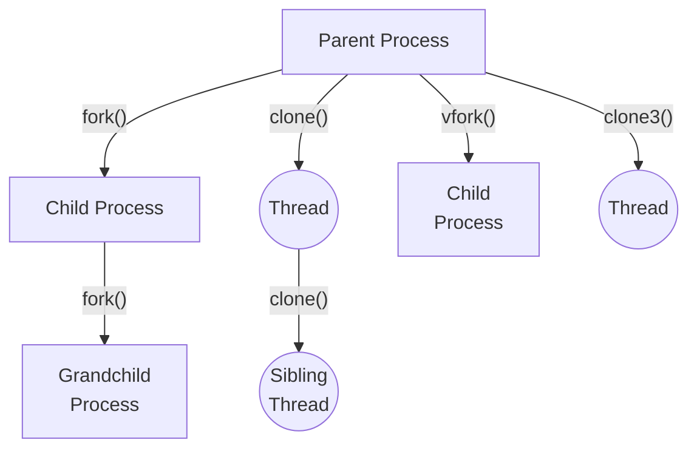

# :material-family-tree: The Family of the Process
Debugging is all fun and games until you have to deal with a process that spawns children. 

So...how are children born? In the [POSIX](https://en.wikipedia.org/wiki/POSIX) standard, children of a process can be either threads or processes. Threads share the same virtual address space, while processes have their own. POSIX-compliant systems such as Linux supply a variety of system calls to create children of both types.

Example family tree of a process in the Linux kernel.

## :material-server: Processes
Child processes are created by system calls such as [fork](https://man7.org/linux/man-pages/man2/fork.2.html), [vfork](https://man7.org/linux/man-pages/man2/vfork.2.html), [clone](https://man7.org/linux/man-pages/man2/clone.2.html), and [clone3](https://man7.org/linux/man-pages/man2/clone.2.html#:~:text=The%20clone3()%20system%20call). The clone and clone3 system calls are configurable, as they allow the caller to specify the resources to be shared between the parent and child.

In the Linux kernel, the [ptrace](https://man7.org/linux/man-pages/man2/ptrace.2.html) system call allows a tracer to handle events like process creation and termination.

Since version 0.8 :sushi: *Chutoro Nigiri* :sushi:, **libdebug** supports handling children process. Read more about it in the dedicated [Multiprocessing](../multiprocessing/) section.

## :material-table-column-plus-after: Threads
Threads of a running process in the [POSIX Threads](https://en.wikipedia.org/wiki/Pthreads) standard are children of the main process. They are created by the system calls [clone](https://man7.org/linux/man-pages/man2/clone.2.html) and [clone3](https://man7.org/linux/man-pages/man2/clone.2.html#:~:text=The%20clone3()%20system%20call). What distinguishes threads from processes is that threads share the same virtual address space.

**libdebug** offers a simple API to work with children threads. Read more about it in the dedicated [Multithreading](../multithreading/) section.