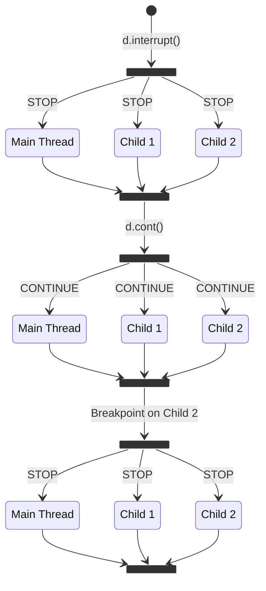
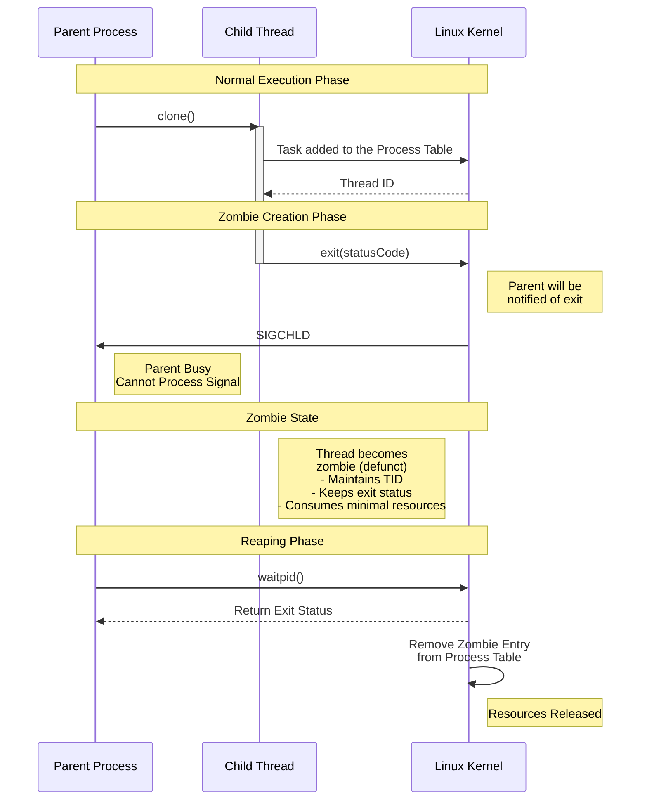

# :material-table-column-plus-after: Debugging Multithreaded Applications
Debugging multi-threaded applications can be a daunting task, particularly in an interactive debugger that is designed to operate on one thread at a time. **libdebug** offers a few features that will help you debug multi-threaded applications more intuitively and efficiently.

## :material-human-male-child: Child Threads
**libdebug** automatically registers new threads and exposes their state with the same API as the main [Debugger](../../from_pydoc/generated/debugger/debugger/) object. While technically threads can be running or stopped independently, **libdebug** will enforce a coherent state. This means that if a live thread is stopped, all other live threads will be stopped as well and if a continuation command is issued, all threads will be resumed.

<div align="center">

</div>
<div style="text-align: center; font-size: 0.85rem;">All live threads are synchronized in their execution state.</div>

## **libdebug** API for Multithreading
To access the threads of a process, you can use the `threads` attribute of the [Debugger](../../from_pydoc/generated/debugger/debugger/) object. This attribute will return a list of [ThreadContext](../../from_pydoc/generated/state/thread_context/) objects, each representing a thread of the process.

If you're already familiar with the [Debugger](../../from_pydoc/generated/debugger/debugger/) object, you'll find the [ThreadContext](../../from_pydoc/generated/state/thread_context/) straightforward to use. The [Debugger](../../from_pydoc/generated/debugger/debugger/) has always acted as a facade for the main thread, enabling you to access registers, memory, and other thread state fields exactly as you would for the main thread. The difference you will notice is that the [ThreadContext](../../from_pydoc/generated/state/thread_context/) object is missing a couple of fields that just don't make sense in the context of a single thread (e.g. symbols, which belong to the binary, and memory maps, since they are shared for the whole process).

```python
from libdebug import debugger

d = debugger("./so_many_threads")
d.run()

# Reach the point of interest
d.breakpoint("loom", file="binary")
d.cont()
d.wait()

for thread in d.threads:
    print(f"Thread {thread.tid} stopped at {hex(thread.regs.rip)}")
    print("Function frame:")
    
    # Retrieve frame boundaries
    frame_start = thread.regs.rbp
    frame_end = thread.regs.rsp

    # Print function frame
    for addr in range(frame_end, frame_start, 8):
        print(f"  {addr:#16x}: {thread.memory[addr:addr+8].hex()}")

[...]
```

### Properties of the ThreadContext

| Property | Type | Description |
| --- | --- | --- |
| `regs` | [Registers](../../from_pydoc/generated/state/registers/) | The thread's registers. |
| `debugger` | [Debugger](../../from_pydoc/generated/debugger/debugger/) | The debugging context this thread belongs to. |
| `memory` | [AbstractMemoryView](../../from_pydoc/generated/memory/abstract_memory_view/) | The memory view of the debugged process (`mem` is an alias). |
| `instruction_pointer` | `int` | The thread's instruction pointer. |
| `process_id` | `int` | The process ID (`pid` is an alias). |
| `thread_id` | `int` | The thread ID (`tid` is an alias). |
| `running` | `bool` | Whether the process is running. |
| `saved_ip` | `int` | The return address of the current function. |
| `dead` | `bool` | Whether the thread is dead. |
| `exit_code` | `int` | The thread's exit code (if dead). |
| `exit_signal` | `str` | The thread's exit signal (if dead). |
| `syscall_arg0` | `int` | The thread's syscall argument 0. |
| `syscall_arg1` | `int` | The thread's syscall argument 1. |
| `syscall_arg2` | `int` | The thread's syscall argument 2. |
| `syscall_arg3` | `int` | The thread's syscall argument 3. |
| `syscall_arg4` | `int` | The thread's syscall argument 4. |
| `syscall_arg5` | `int` | The thread's syscall argument 5. |
| `syscall_number` | `int` | The thread's syscall number. |
| `syscall_return` | `int` | The thread's syscall return value. |
| `signal` | `str` | The signal will be forwarded to the thread. |
| `signal_number` | `int` | The signal number to forward to the thread. |
| `zombie` | `bool` | Whether the thread is in a zombie state. |

### Methods of the ThreadContext

| Method | Description | Return Type |
| --- | --- | --- |
| `set_as_dead()` | Set the thread as dead. | `None` |
| `step()` | Executes a single instruction of the process (`si` is an alias). | `None` |
| `step_until(position: int, max_steps: int = -1, file: str = "hybrid")` | Executes instructions of the process until the specified location is reached (`su` is an alias). | `None` |
| `finish(heuristic: str = "backtrace")` | Continues execution until the current function returns or the process stops (`fin` is an alias). | `None` |
| `next()` | Executes the next instruction of the process. If the instruction is a call, the debugger will continue until the called function returns (`fin` is an alias). | `None` |
| `backtrace(as_symbols: bool = False)` | Returns the current backtrace of the thread (see [Stack Frame Utils](../../quality_of_life/stack_frame_utils/)). | `list` |
| `pprint_backtrace()` | Pretty prints the current backtrace of the thread (see [Pretty Printing](../../quality_of_life/pretty_printing)). | `None` |
| `pprint_registers()` | Pretty prints the thread's registers (see [Pretty Printing](../../quality_of_life/pretty_printing)). | `None` |
| `pprint_regs()` | Alias for the `pprint_registers` method (see [Pretty Printing](../../quality_of_life/pretty_printing)). | `None` |
| `pprint_registers_all()` | Pretty prints all the thread's registers (see [Pretty Printing](../../quality_of_life/pretty_printing)). | `None` |
| `pprint_regs_all()` | Alias for the `pprint_registers_all` method (see [Pretty Printing](../../quality_of_life/pretty_printing)). | `None` |

!!! WARNING "Meaning of the debugger object"
    When accessing state fields of the [Debugger](../../from_pydoc/generated/debugger/debugger/) object (e.g. registers, memory), the debugger will act as an alias for the main thread. For example, doing d.regs.rax will be equivalent to doing d.threads[0].regs.rax.

## :material-share: Shared and Unshared State
Each thread has its own register set, stack, and instruction pointer. However, the virtual address space is shared among all threads. This means that threads can access the same memory and share the same code.

!!! EXAMPLE "How to access TLS?"
    While the virtual address space is shared between threads, each thread has its own [Thread Local Storage (TLS)](https://en.wikipedia.org/wiki/Thread-local_storage) area. As it stands, **libdebug** does not provide a direct interface to the TLS area.

Let's see a couple of things to keep in mind when debugging multi-threaded applications with **libdebug**.

### :material-sign-caution: Software Breakpoints

Software breakpoints are implemented through code patching in the process memory. This means that a breakpoint set in one thread will be replicated across all threads.

When using [synchronous](../../stopping_events/debugging_flow) breakpoints, you will need to "diagnose" the stopping event to determine which thread triggered the breakpoint. You can do this by checking the return value of the [`hit_on()`](../../stopping_events/debugging_flow/#hit-records) method of the [Breakpoint](../../from_pydoc/generated/data/breakpoint/) object. Passing the [ThreadContext](../../from_pydoc/generated/state/thread_context/) as an argument will return `True` if the breakpoint was hit by that thread.

!!! ABSTRACT "Diagnosing a Synchronous Breakpoint"
    ```python
    thread = d.threads[2]

    for addr, bp in d.breakpoints.items():
        if bp.hit_on(thread):
            print(f"Thread {thread.tid} hit breakpoint {addr:#x}")
    ```

When using [asynchronous](../../stopping_events/debugging_flow) breakpoints, the breakpoint will be more intuitive to handle, as the signature of the [callback function](../../stopping_events/breakpoints#callback-signature) includes the [ThreadContext](../../from_pydoc/generated/state/thread_context/) object that triggered the breakpoint.

!!! ABSTRACT "Handling an Asynchronous Breakpoint"
    ```python
    def on_breakpoint_hit(t, bp):
        print(f"Thread {t.tid} hit breakpoint {bp.address:#x}")

    d.breakpoint(0x10ab, callback=on_breakpoint_hit, file="binary")
    ```

### :octicons-cpu-24: Hardware Breakpoints and Watchpoints
While hardware breakpoints are thread-specific, **libdebug** mirrors them across all threads. This is done to avoid asymmetries with software breakpoints. Watchpoints are hardware breakpoints, so this applies to them as well.

For consistency, [syscall handlers](../../stopping_events/syscalls) are also enabled across all threads. The same considerations for synchronous and asynchronous breakpoints apply here as well.

!!! WARNING "Concurrency in Syscall Handling"
    When debugging entering and exiting events in syscalls, be mindful of the scheduling. The kernel may schedule a different thread to handle the syscall exit event right after the enter event of another thread.

### :material-traffic-light-outline: Signal Catching

<div style="text-align: center;">
    
    
</div>

<div style="text-align: center; font-size: 0.85rem;">
Who will receive the signal?
</div> 

[Signal Catching](../../stopping_events/signals) is also shared among threads. Apart from consistency, this is a necessity. In fact, the kernel does not guarantee that a signal sent to a process will be dispatched to a specific thread. By contrast, when sending arbitrary signals through the [ThreadContext](../../from_pydoc/generated/state/thread_context/) object, the signal will be sent to the requested thread.

## :fontawesome-regular-file-zipper: Snapshot Behavior
When creating a [snapshot](../../save_states/snapshots) of a process from the corresponding [Debugger](../../from_pydoc/generated/debugger/debugger/) object, the snapshot will also save the state of all threads. You can also create a snapshot of a single thread by calling the [`create_snapshot()`](../../save_states/snapshots/#creating-snapshots) method from the [ThreadContext](../../from_pydoc/generated/state/thread_context/) object instead. Read more about snapshots in the [Save States](../../save_states) section.

## :material-brain: Zombie Threads
When a thread or process terminates, it enters a **zombie** state. This is a temporary condition where the process is effectively dead but awaiting *reaping* by the parent or debugger, which involves reading its status. Reaping traced zombie threads can become complicated due to certain edge cases.

While **libdebug** automatically handles the reaping of zombie threads, it provides a property named `zombie` within the [ThreadContext](../../from_pydoc/generated/state/thread_context/) object, indicating whether the thread is in a zombie state. The same property is also available in the [Debugger](../../from_pydoc/generated/debugger/debugger/) object, indicating whether the main thread is in a zombie state.

!!! ABSTRACT "Example Code"
    ```python
    if d.threads[1].zombie:
        print("The thread is a zombie")
    ```


