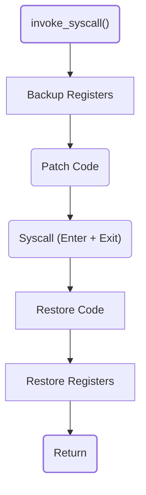

# :fontawesome-solid-wand-magic-sparkles: Arbitrary Code Execution
Debugging is primarily a way to follow the execution of a program and understand its behavior. Stepping, stopping, continuing, reading registers...these are all tools that only serve to help humans understand the running code at their own pace. However, a debugger's intervention in a program execution can be much more than that. The debugger can virtually do anything to the program it is debugging, including changing its behavior, modifying its memory, and even executing arbitrary code.

<div style="text-align: center;">
    
    
</div>


Since **libdebug** 0.9.0 NAME_TO_BE_DETERMINED, **libdebug** offers some primitives to perform arbitrary code execution inside a process. Specifically, it allows for the arbitrary invocation of *syscalls*. This can be useful for a variety of purposes, such as:

- Playing with file descriptors
- Allocating new memory maps
- Forking the process to create checkpoints (feature coming soon)
- Opening sockets to turn offline interactions into a service

All of this is essentially live-patching the running code to perform arbitrary actions. This is a powerful feature that can be used to perform a variety of tasks, but it should be used with caution.

!!! WARNING "Altering The Control Flow"
    The control flow of a binary is a delicate thing. When executing arbitrary code, **libdebug** cannot guarantee that the process won't crash or behave unexpectedly. Remember, you are changing things under the hood without the program's knowledge.

## :fontawesome-solid-terminal: Syscall Invocation
Invoking a syscall is as simple as calling the [`invoke_syscall()`](../../from_pydoc/generated/state/thread_context/#libdebug.state.thread_context.ThreadContext.invoke_syscall) method of the [`ThreadContext`](../../from_pydoc/generated/state/thread_context/) class or the [`Debugger`](../../from_pydoc/generated/debugger/debugger/) object. In the latter case, the syscall will be invoked in the context of the main thread of the process. 

What exactly happens when you call this primitive?

<div align="center">

</div>
Additionally, when the syscall is a [`fork`](https://man7.org/linux/man-pages/man2/fork.2.html), [`vfork`](https://man7.org/linux/man-pages/man2/vfork.2.html) or [`clone`](https://man7.org/linux/man-pages/man2/clone.2.html), the function will also restore the state in the child process / thread. This is done by copying the registers from the parent process / thread to the child process / thread.

As you can see, registers values are restored after the syscall is executed to reduce the chances of the process crashing. However, be mindful that the syscall is indeed executed. Thus, the state of the process will have changed.

### :octicons-code-24: Syscall Invocation API

The following is the API of the arbitrary syscall invocation:
invoke
!!! ABSTRACT "Function Signature"
    ```python
    d.invoke_syscall(syscall_identifier: str | int, ...) -> int:
    ```

**Parameters**:

| Argument | Type | Description |
| --- | --- | --- |
| `syscall_identifier` | `str` \| `int` | The syscall name or number. |
| `...` | `int` | The arguments to be passed to the syscall. Not fixed, since the number of arguments depends on the syscall. |

**Returns**:

| Return | Type | Description |
| --- | --- | --- |
| `int` | `int` | The return value from the syscall invocation. |


!!! QUESTION "Where can I call this?"
    You can invoke syscalls whenever the process is stopped. The invocation can happen both synchronously and asynchronously (in a callback). The only exception to that is when the process is stopped on another syscall's enter or inside a syscall handling callback.